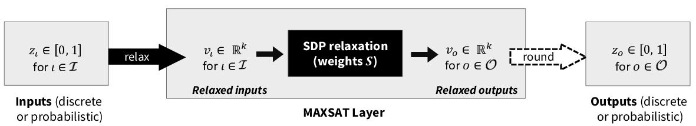

# SATNet • [![PyPi][pypi-image]][pypi] [![colab][colab-image]][colab] [![License][license-image]][license] 

[license-image]: https://img.shields.io/badge/License-MIT-yellow.svg
[license]: LICENSE

[pypi-image]: https://img.shields.io/pypi/v/satnet.svg
[pypi]: https://pypi.python.org/pypi/satnet

[colab-image]: https://colab.research.google.com/assets/colab-badge.svg
[colab]: https://colab.research.google.com/

*Bridging deep learning and logical reasoning using a differentiable satisfiability solver.*


## What is a SATnet




## Installation

### pip
```bash
pip install satnet
```


### From source
```bash
git clone https://github.com/locuslab/SATNet
cd SATNet && python setup.py install
```

#### Package Dependencies
```
conda install -c pytorch tqdm
```


### Docker Image
```bash
cd docker
sh ./build.sh
sh ./run.sh
```

## Experiments:
### Jupyter Notebook and Google Colab
[Jupyter notebook](https://github.com/locuslab/SATNet/blob/master/notebooks/Learning%20and%20Solving%20Sudoku%20via%20SATNet.ipynb)
and [Google Colab]()

### Run them manually

#### Getting the datasets
The [Sudoku dataset](https://powei.tw/sudoku.zip) and [Parity dataset](https://powei.tw/parity.zip) can be downloaded via

```bash
wget -cq powei.tw/sudoku.zip && unzip -qq sudoku.zip
wget -cq powei.tw/parity.zip && unzip -qq parity.zip
```
#### Sudoku Experiments
```bash
python exps/sudoku.py
python exps/sudoku.py --perm
python exps/sudoku.py --mnist --batchSz=50
```

#### Parity Experiments
```bash
pyhton exps/parity.py --seq=20
pyhton exps/parity.py --seq=40
```